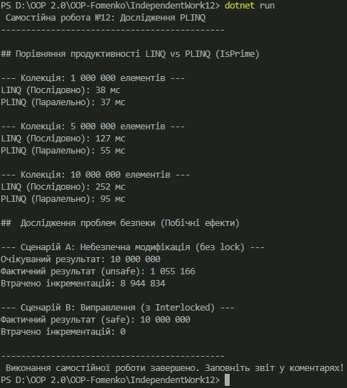

## Короткий звіт про Самостійну роботу №12: PLINQ

## Тема: 
Дослідження продуктивності та безпеки PLINQ 

## Мета:
 Дослідити, коли паралельний LINQ (PLINQ) є ефективнішим за звичайний LINQ, а також проаналізувати критичні проблеми потокобезпечності при його використанні.

## Аналіз продуктивності
 Експерименти проводилися з обчислювально інтенсивною операцією (перевірка на просте число) на колекціях розміром від 1 до 10 мільйонів елементів.
 1. Перевага PLINQ: PLINQ демонструє значне прискорення (прискорення $> 1$) на великих обсягах даних (5–10 мільйонів елементів). Виграш досягається за рахунок ефективного розподілу обчислювальної роботи між кількома ядрами процесора.
 2. Недоліки PLINQ: На невеликих колекціях (1 мільйон) прискорення мінімальне або відсутнє. Це пояснюється тим, що накладні витрати на розпаралелювання (створення, синхронізацію та об'єднання потоків) перевищують час послідовної обробки.
 Висновок по продуктивності: Використання PLINQ доцільне лише для завдань, де обсяг даних великий, а операція складна (CPU-bound).

## Проблеми безпеки (Побічні ефекти)
У PLINQ найбільша небезпека виникає при спробі модифікувати спільний стан (змінні поза запитом).

## Сценарій проблеми
Спроба паралельно інкрементувати спільну змінну unsafeCounter (наприклад, unsafeCounter++) призвела до стану гонитви (race condition). Оскільки операція інкременту не є атомарною, кілька потоків одночасно зчитували одне й те саме значення, внаслідок чого значна частина інкрементацій була втрачена, а фінальний результат був некоректним.

## Виправлення 
Проблема була успішно усунена за допомогою класу System.Threading.Interlocked. Метод Interlocked.Increment() гарантує, що операція виконується атомарно (як єдина, неподільна дія), унеможливлюючи конфлікти між потоками.

## Загальні висновки
PLINQ є потужним інструментом для масштабування продуктивності. Однак, його використання вимагає глибокого розуміння:
1. Доцільності: Застосовувати лише для великих та обчислювально інтенсивних завдань.
2. Безпеки: Категорично заборонено модифікувати спільний стан без захисту. Будь-яка взаємодія зі змінними поза запитом PLINQ має бути захищена механізмами синхронізації (наприклад, Interlocked або lock).