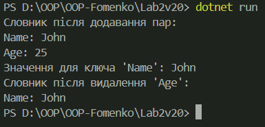

# Лабораторна робота №2
## Тема: Інкапсуляція, індексатори, перевантаження операторів

### Мета:
Закріпити знання про інкапсуляцію, використання індексаторів і перевантаження операторів у C#.

---

### Виконання:
- Реалізовано клас `Dictionary` для роботи зі словником пар ключ-значення.
- Використано індексатор для доступу до значень за ключем.
- Перевантажено оператори `+` та `-` для додавання та видалення пар ключ-значення.
- Додано метод `Display` для виведення всіх пар ключ-значення.
- Код містить коментарі до ключових частин.

---

### Приклади запуску:


---

## Контрольні запитання

**1. Що таке інкапсуляція?**  
Інкапсуляція — це механізм ООП, який обмежує доступ до даних об'єкта і дозволяє керувати цим доступом через методи або властивості.

---

**2. Як працює індексатор у C#?**  
Індексатор дозволяє об'єкту поводитися як масив. Він визначається через ключове слово `this` і параметри, які використовуються для доступу до значень.

---

**3. Як перевантажити оператор у C#?**  
Для перевантаження оператора використовується ключове слово `operator`. Наприклад:
```csharp
public static ClassName operator +(ClassName obj, Type value)
{
    // Реалізація оператора
}

---

**4. У чому переваги використання індексаторів?**
Індексатори спрощують доступ до даних об'єкта, дозволяючи використовувати синтаксис, схожий на масиви.

---

**5. Які оператори можна перевантажувати?**
У C# можна перевантажувати більшість операторів, таких як +, -, *, /, ==, !=, але не всі (наприклад, оператори . або ?: не можна перевантажити).

---

**Висновок:**
У цій лабораторній роботі було закріплено знання про інкапсуляцію, індексатори та перевантаження операторів. Реалізований клас Dictionary демонструє практичне застосування цих концепцій.