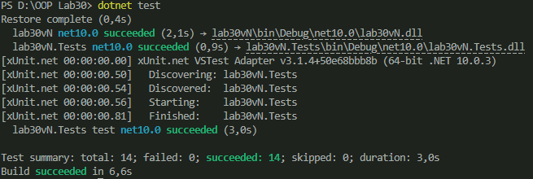

# Лабораторна робота 30

Тема: Написання юніт-тестів з xUnit

### Мета
Навчитися писати юніт-тести для власного коду за допомогою xUnit.

### Варіант
19 - LoanCalculator

### Опис
Реалізовано клас LoanCalculator для обчислення щомісячного платежу по кредиту.

Метод:
CalculateMonthlyPayment(loanAmount, annualRate, months)

### Тестування
Створено тестовий проєкт lab30vN.Tests з використанням xUnit.

Написано 14 тестів:
- перевірка правильних значень
- параметризовані тести (Theory)
- перевірка помилок
- edge cases

### Запуск тестів

