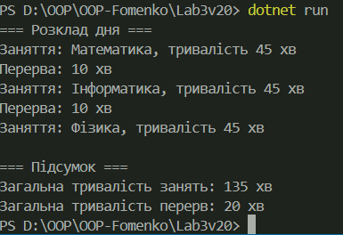

# Лабораторна робота №3
## Тема: Наслідування: основи

### Мета:
Закріпити знання про базові та похідні класи, використання `base`, перевизначення методів і поліморфізм.

---

### Виконання:
- Створено базовий клас `TimeSpanBase`.
- Реалізовано два похідні класи: `LessonTime` та `BreakTime`.
- Продемонстровано **поліморфізм** через спільну колекцію об’єктів.
- Виконано обчислення загальної тривалості занять і перерв.
- Код містить коментарі до ключових частин.

---

### Приклади запуску:

---

## Контрольні запитання

**1. Що таке наслідування та для чого воно використовується?**  
Наслідування — це механізм ООП, який дозволяє створювати нові класи на основі вже існуючих.  
Воно використовується для повторного використання коду, спрощення структури програм і побудови ієрархій об’єктів.

---

**2. Чим відрізняється `virtual` від `abstract` методу?**  
- `virtual` — має реалізацію в базовому класі, але може бути перевизначений у похідному.  
- `abstract` — **не має реалізації** і **обов’язковий до перевизначення** у всіх похідних класах.

---

**3. Як працює ключове слово `base`?**  
`base` використовується для звернення до елементів базового класу (методів, властивостей або конструкторів).  
З його допомогою можна викликати конструктор базового класу з похідного класу або перевизначений метод бази.

---

**4. Що таке поліморфізм часу виконання?**  
Це здатність викликати метод, який відповідає **фактичному типу об’єкта**, а не типу змінної, що його зберігає.  
Реалізується через ключові слова `virtual`, `override` і механізм динамічного зв’язування під час виконання програми.

---

**5. У чому різниця між композицією та наслідуванням?**  
- **Наслідування** — створює відношення *«є»* (наприклад, `Кіт є Тварина`).  
- **Композиція** — створює відношення *«має»* (наприклад, `Кіт має Хвіст`).  
Композиція більш гнучка, бо дозволяє змінювати склад об’єкта без створення нових класів.

