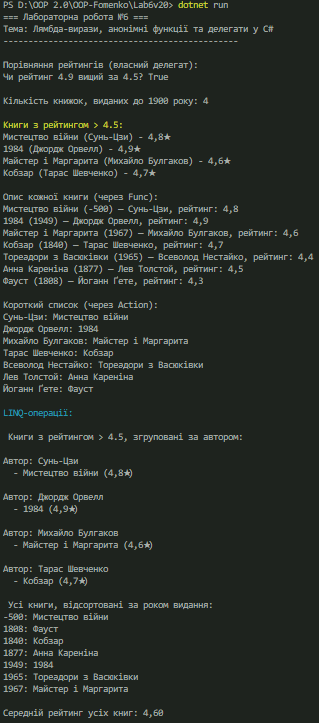

## Лабораторна робота №6 Варіант 10

## Тема: 
Лямбда-вирази, анонімні функції та делегати у C#

## Мета роботи:
Закріпити знання про делегати та події. Навчитись використовувати анонімні методи, лямбда-вирази і вбудовані делегати (Func<>, Action<>, Predicate<>). Отримати практичний досвід застосування лямбда-виразів у колекціях і LINQ-операціях.

## Хід виконання:
Було створено клас Book, який містить поля: назва, автор, рік видання та рейтинг. На основі цього класу сформовано колекцію об’єктів типу List<Book>.

У програмі реалізовано власний делегат для порівняння рейтингів, а також анонімний метод для підрахунку кількості старих книжок. Використано стандартні делегати:

1. Predicate<Book> для фільтрації книг із рейтингом понад 4.5;
2. Func<Book, string> для створення текстового опису книги;
3. Action<Book> для відображення короткої інформації у консоль.

За допомогою лямбда-виразів і LINQ виконано фільтрацію, групування книг за автором, сортування за роком видання та обчислення середнього рейтингу.

## Результати роботи:
Програма успішно демонструє роботу з делегатами, анонімними функціями, лямбда-виразами та LINQ. Отримано список книг із високими рейтингами, виконано групування за авторами, виведено відсортований перелік і середній рейтинг.

## Висновок:
Під час виконання лабораторної роботи було закріплено навички створення та використання делегатів, лямбда-виразів і вбудованих делегатів. Отримано практичний досвід застосування LINQ для обробки колекцій у C#.

