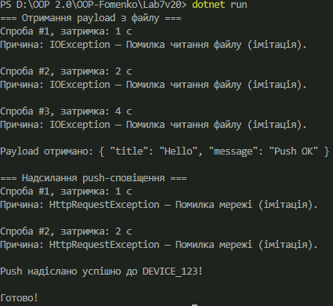

## Лабораторна робота №7

## Тема: 
Обробка IO/мережевих помилок та патерн Retry

## Мета: 
Навчитися обробляти помилки вводу/виводу та мережеві помилки за допомогою try-catch-finally, а також реалізувати патерн Retry з експоненційною затримкою.

## Теоретичні відомості
Винятки вводу/виводу
Виникають під час роботи з файлами або потоками. Основні типи:

1. FileNotFoundException — файл не знайдено.
2. DirectoryNotFoundException — немає каталогу.
3. IOException — загальна помилка вводу/виводу (немає доступу, зайнятий файл, збій пристрою).

## Мережеві винятки
Виникають під час HTTP-запитів або роботи з сокетами:

1. HttpRequestException
2. SocketException
3. TimeoutException

## try-catch-finally
Конструкція для обробки помилок:

1. try — код, де може статись помилка
2. catch — обробка помилки
3. finally — виконується завжди (закриття файлів, очищення ресурсів)

## Контрольні питання

## 1. Які типи винятків найчастіше виникають при роботі з файлами та мережею?

Файли:

1. FileNotFoundException
2. DirectoryNotFoundException
3. IOException

Мережа:

1. HttpRequestException
2. SocketException
3. TimeoutException

## 2. Поясніть принцип роботи патерну Retry. Коли його доцільно використовувати?

Патерн Retry означає:
Якщо операція тимчасово завершилась невдачею — повторити спробу через певний інтервал часу.

Використовується коли:

1. мережа нестабільна
2. сервер перевантажений
3. файл тимчасово заблокований
4. ресурс недоступний короткий час

## 3. Як реалізувати експоненційну затримку між повторними спробами?

Затримка збільшується у степені 2:
delay = initialDelay * 2^(attempt - 1)

Приклад:
1 сек → 2 сек → 4 сек → 8 сек

## 4. Для чого потрібен делегат shouldRetry у RetryHelper?

Щоб визначити, для яких помилок потрібно повторювати спробу, а для яких — ні.

Наприклад:
retry тільки якщо це IOException або HttpRequestException

Це дозволяє відрізняти:

1. тимчасові помилки, де retry корисний
2. критичні помилки, де retry недоречний

